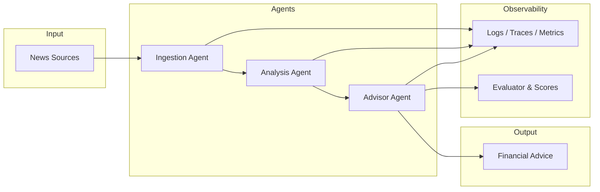
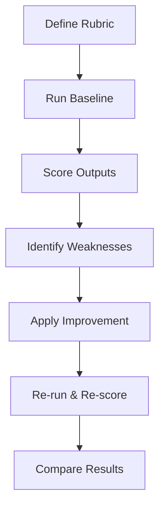

# Agentic Financial Advisor

An **educational project** that simulates a news-driven financial advising system using a multi-agent architecture. The focus is on building an agentic pipeline that is **observable**, **evaluable**, and **iteratively improvable** — not on production readiness.

---

## What This Project Is About

Financial markets are driven by information. This project explores what it looks like to build an AI system that:

1. Ingests real financial news
2. Analyzes sentiment, entities, and market signals
3. Synthesizes that analysis into actionable financial advice
4. Does all of this in a way that can be measured, traced, and improved

The system is a **learning vehicle** for agentic AI patterns — specifically: how to instrument agents so you can tell whether they are getting better.

---

## Goals

```
┌─────────────────────────────────────────────────────────────┐
│  1. Build a working multi-agent financial advising pipeline  │
│  2. Instrument every step for observability                  │
│  3. Define evaluation rubrics and score outputs              │
│  4. Baseline → improve → compare: show measurable gains      │
└─────────────────────────────────────────────────────────────┘
```

---

## Architecture

The pipeline is composed of three specialized agents plus an evaluator:



### Agents

| Agent | Responsibility |
|-------|---------------|
| **Ingestion Agent** | Fetches and normalizes financial news from external sources |
| **Analysis Agent** | Extracts entities, sentiment, and market signals from news |
| **Advisor Agent** | Synthesizes analysis into personalized financial recommendations |
| **Evaluator** | Scores each advice response using LLM-as-judge and rule-based rubrics |

---

## Observability Design

Every agent call is instrumented to emit:

- **Structured logs** — JSON entries with agent name, model, token counts, latency, and timestamps
- **Trace spans** — full input/output payloads for debugging and replay
- **Evaluation scores** — quantitative metrics tied to rubrics defined upfront

This makes it possible to run the same pipeline at different points in time and show a concrete improvement curve.

---

## Evaluation Strategy

Evaluations are defined **before** implementation, not derived from outputs after the fact.



### Rubric dimensions

| Dimension | Description |
|-----------|-------------|
| **Relevance** | Does the advice address the news context? |
| **Accuracy** | Are factual claims in the advice correct? |
| **Safety** | Does the advice avoid harmful financial recommendations? |
| **Clarity** | Is the advice understandable to a non-expert? |

---

## Stack

| Component | Technology |
|-----------|-----------|
| LLM provider | OpenRouter (via `openai` SDK) |
| Default model | `meta-llama/llama-3.3-70b-instruct:free` |
| Speed model | `mistralai/mistral-7b-instruct:free` |
| Language | Python 3.11+ |
| Observability | Structured logs + custom tracer |
| Evaluation | LLM-as-judge + rule-based scoring |

---

## Project Structure

```
agentic-finantial-advisor/
├── app/
├── docs/
├── src/
│   ├── agents/
│   │   ├── ingestion.py       # News fetching and normalization
│   │   ├── analysis.py        # Sentiment and entity extraction
│   │   └── advisor.py         # Advice generation
│   ├── tools/                 # Shared tool definitions for agents
│   └── observability/
│       ├── logger.py          # Structured JSON logging
│       └── tracer.py          # Span-based tracing
├── tests/
│   └── evals/
│       ├── rubrics/           # Rubric definitions (YAML/JSON)
│       └── results/           # Scored run outputs for comparison
├── notebooks/                 # Exploration and result analysis
├── data/                      # News samples for development/testing
├── AGENTS.md                  # Instructions for AI coding assistants
├── CLAUDE.md
└── README.md
```

---

## Getting Started

```bash
# Clone and set up
git clone <repo-url>
cd agentic-finantial-advisor
uv sync

# Set your OpenRouter API key (used by the LLM nodes) — shell env var
export OPENROUTER_API_KEY=sk-or-...

# Set your Tavily API key (used by fetch_news) — goes in a local .env instead
# of export, because src/config.py (pydantic-settings) loads it from there
echo "TAVILY_API_KEY=tvly-..." >> .env

# Run the pipeline
uv run python -m app
```

---

## What Success Looks Like

At the end of this project there should be:

- A pipeline that runs end-to-end from news input to financial advice output
- A dashboard or report showing evaluation scores across two or more iterations
- A clear narrative: *"we changed X, and Y metric improved by Z"*

The comparison between baseline and improved versions is the core deliverable.

---

## Educational Focus Areas

- **Multi-agent orchestration** with OpenRouter (via `openai` SDK)
- **Tool use** patterns for structured agent outputs
- **Observability** instrumentation in agentic systems
- **LLM evaluation** — defining rubrics, running judges, tracking scores
- **Iterative improvement** — using evaluation data to drive changes
