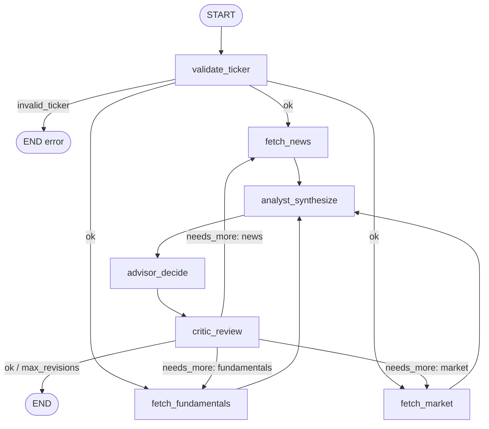

# LangGraph Graph Design — Agentic Financial Advisor (v1)

## Context

End-to-end design of the LangGraph flow that, given a company ticker, produces a structured recommendation (`BUY/HOLD/SELL` + confidence + drivers) along with its reasoning. This document defines the **topology and contracts** so that implementing each node becomes trivial.

The initial hand-drawn diagram had two parallel branches (news + fundamentals) converging into a synthesis node and then into a decision. After reviewing the diagram, the README, and the LangGraph documentation, 8 issues were identified (missing market data, insufficient binary output, no reflection, no reducers for fan-out, no failure handling, etc.) and 6 design decisions were closed:

| Decision | Outcome |
|---|---|
| Parallel data sources | **3 branches**: News + Fundamentals + Market |
| Output schema | `BUY/HOLD/SELL` + `confidence` + `key_drivers[]` + `time_horizon` |
| Input scope | Only `ticker: str` (passed directly, no name resolution) |
| Reflection | Yes, **critic with max_iterations=2** |
| Node after fan-out | **Analyst LLM** (synthesizes structured report, separated from Advisor) |
| Critic loopback | Critic identifies the weak branch and only re-runs that one via `Send()` |

---

## Graph architecture



**LangGraph pattern**: fan-out with three `add_edge(validate_ticker, fetch_X)`, implicit join at `analyst_synthesize` (LangGraph waits for all upstreams by default), `add_conditional_edges` from `validate_ticker` (early exit) and from `critic_review` (`Send` to the weak branch or `END`).

### Nodes

| Node | Type | Function |
|---|---|---|
| `validate_ticker` | **Pure function (no LLM)** | Calls `yf.Ticker(ticker).info`. If it returns valid `symbol`/`quoteType` → sets `company_name` and routes to fan-out. If it raises or returns empty → conditional edge to END with `error`. No LLM: this is a deterministic, cheap check. |
| `fetch_news` | Tool node | Calls a news API (suggested: Tavily or NewsAPI), returns normalized list `NewsItem[]`. Reads `critic_feedback` if present to refine the query. |
| `fetch_fundamentals` | Tool node | yfinance `.info` + `.financials` + computed ratios. Returns `FundamentalsSnapshot`. |
| `fetch_market` | Tool node | yfinance `.history()` last 6m + indicators (SMA, RSI, volatility). Returns `MarketSnapshot`. |
| `analyst_synthesize` | LLM (Pydantic structured output) | Synthesizes the 3 branches into an `AnalystReport` (summary + signals + risks). This is the "Analysis Agent" from the README. |
| `advisor_decide` | LLM (Pydantic structured output) | Decides based on the report: emits `AdvisorDecision`. This is the "Advisor Agent" from the README. |
| `critic_review` | LLM (Pydantic structured output) | Evaluates the decision + report, emits a `CriticVerdict` with `status` and `needs_more` (weak branch) if applicable. |

---

## State schema (Pydantic)

LangGraph 1.x supports `BaseModel` as a state schema natively, with validation on every transition. We use Pydantic instead of `TypedDict` for consistency with the rest of the schemas, automatic validation, and better DX (autocomplete, clear errors when a node returns a malformed object).

```python
from typing import Annotated
import operator
from pydantic import BaseModel, Field

class AdvisorState(BaseModel):
    # Input
    ticker: str
    company_name: str | None = None

    # Raw resources (each branch writes its own field → no reducer needed)
    news_data: list[NewsItem] | None = None
    fundamentals_data: FundamentalsSnapshot | None = None
    market_data: MarketSnapshot | None = None

    # Synthesis and decision
    analyst_report: AnalystReport | None = None
    decision: AdvisorDecision | None = None

    # Reflection
    critic_verdict: CriticVerdict | None = None
    critic_feedback: str | None = None          # text branches can read to refine queries
    revision_count: int = 0                      # incremented on each loopback (cap 2)

    # Errors (only field that does need a reducer because any branch may contribute)
    errors: Annotated[list[str], operator.add] = Field(default_factory=list)
```

**Why each branch has its own field instead of `Annotated[..., operator.add]`**: the three branches write heterogeneous outputs (news, financials, prices), not lists meant to be concatenated. Assigning to distinct fields eliminates the need for a reducer and keeps the state explicit and typed.

**Structured output**: the LLM nodes (`analyst_synthesize`, `advisor_decide`, `critic_review`) use structured output that returns **a Pydantic instance directly** (e.g. `client.beta.chat.completions.parse(..., response_format=AdvisorDecision)`), not a dict. The result is assigned to the corresponding state field without manual parsing.

---

## Output / Pydantic schemas

```python
class AdvisorDecision(BaseModel):
    action: Literal["BUY", "HOLD", "SELL"]
    confidence: float                     # 0.0 – 1.0
    time_horizon: Literal["short", "medium", "long"]
    key_drivers: list[str]                # 3-5 reasons
    reasoning: str                        # free-form explanation, ≤ 500 words

class AnalystReport(BaseModel):
    summary: str
    bull_case: list[str]
    bear_case: list[str]
    notable_signals: list[str]
    data_quality_flags: list[str]         # e.g. "missing Q4 earnings"

class CriticVerdict(BaseModel):
    status: Literal["ok", "needs_more"]
    confidence_in_decision: float
    needs_more: Literal["news", "fundamentals", "market"] | None
    feedback: str
```

---

## Critic loop semantics

1. After `advisor_decide`, `critic_review` evaluates the decision against the report and raw data.
2. `add_conditional_edges("critic_review", route_after_critic)` returns:
   - `END` if `status == "ok"` **or** if `revision_count >= 2` (hard cap).
   - `Send("fetch_<branch>", {...state, critic_feedback: verdict.feedback, revision_count: state.revision_count + 1})` if `needs_more` is set.
3. The re-executed branch reads `critic_feedback` to refine its query/scope. After that, the flow naturally continues through `analyst_synthesize → advisor_decide → critic_review`.
4. **Important**: only the weak branch is re-executed; the other two keep their data from the first pass. This requires `analyst_synthesize` to be idempotent with respect to already-populated fields (it does not overwrite them).

---

## Observability (v1: logs only)

For v1 we limit ourselves to **logs** — the tracer is out of scope and will be added in a later iteration. Two levels, distinct purposes:

### 1. `INFO` narrative logs (to understand the flow)

Each node emits readable `INFO` messages that narrate what is happening. The goal is that running the graph lets you **read the trace in the console** and understand exactly what the system did, in what order, and with what data. Useful for learning and debugging.

Examples:
```
INFO  graph         Starting flow for ticker=AAPL
INFO  validate      Validating ticker AAPL against yfinance...
INFO  validate      Ticker OK · company_name='Apple Inc.' · quoteType='EQUITY'
INFO  graph         Fan-out → fetch_news ∥ fetch_fundamentals ∥ fetch_market
INFO  fetch_news    Querying Tavily with query='AAPL stock news'...
INFO  fetch_news    Received 7 news items (range: last 7 days)
INFO  fetch_fund    yfinance .info OK · P/E=28.4, market_cap=2.9T
INFO  fetch_market  Downloaded 126 days of prices · SMA50=180.3, RSI=58
INFO  analyst       Synthesizing report with model=llama-3.3-70b-instruct...
INFO  analyst       Report ready · 3 bull_case, 2 bear_case, 0 data_flags
INFO  advisor       Decision: BUY · confidence=0.72 · horizon=medium
INFO  critic        Verdict=needs_more · branch=news · feedback='missing earnings coverage'
INFO  graph         Loopback → fetch_news (revision_count=1)
...
INFO  critic        Verdict=ok · confidence_in_decision=0.81
INFO  graph         END · decision=BUY
```

Implementation: `logging.getLogger(__name__).info(...)` with a simple formatter `%(levelname)s  %(name)s  %(message)s`. Centralized configuration in `src/observability/logger.py`.

### 2. Structured JSON logs (for metrics)

Each node additionally emits, at start and at end, **a JSON log** with:
`node_name`, `model` (if applicable), `input_tokens`, `output_tokens`, `latency_ms`, `timestamp`, `revision_count`, `status` (`ok` / `error`).

These will later feed dashboards and baseline-vs-improved comparisons. For now they are written to stdout or to a file `runs/<timestamp>.jsonl`.

Helper `log_node_event(name, **kwargs)` in `src/observability/logger.py`. No spans, no tracer, no eval hook yet.

---

## File structure to create

Follows the repo structure defined in `AGENTS.md`. The folder is named `nodes/` (not `agents/`) because semantically these are nodes of a LangGraph graph, not autonomous agents.

```
agentic-finantial-advisor/
├── app/
│   └── __main__.py             # CLI: parses ticker, invokes graph.invoke(...), prints result
├── docs/
│   └── graph-design.md         # this document
├── src/
│   ├── graph/
│   │   ├── state.py            # AdvisorState (Pydantic BaseModel) + auxiliary types
│   │   ├── schemas.py          # AdvisorDecision, AnalystReport, CriticVerdict, NewsItem, FundamentalsSnapshot, MarketSnapshot
│   │   └── builder.py          # StateGraph(AdvisorState), edges, conditional edges, compile()
│   ├── nodes/
│   │   ├── validator.py        # validate_ticker (pure function over yfinance, no LLM)
│   │   ├── fetchers.py         # fetch_news, fetch_fundamentals, fetch_market
│   │   ├── analyst.py          # analyst_synthesize
│   │   ├── advisor.py          # advisor_decide
│   │   └── critic.py           # critic_review + route_after_critic
│   ├── tools/                  # reusable helpers (Tavily client, yfinance wrappers, etc.)
│   └── observability/
│       └── logger.py           # INFO narrative log + log_node_event JSON (no tracer in v1)
└── tests/
    └── evals/
        ├── rubrics/            # (next iteration)
        └── results/            # (next iteration)
```

---

## Stack suggestions (to confirm at implementation time)

| Layer | Suggestion | Reason |
|---|---|---|
| LLM | OpenRouter via `openai` SDK | Mandate from AGENTS.md |
| Structured output | `client.beta.chat.completions.parse(..., response_format=PydanticModel)` → returns a Pydantic instance | Needed for `AdvisorDecision`, `AnalystReport`, `CriticVerdict` |
| News | Tavily Search API | Good free tier, returns pre-filtered snippets |
| Fundamentals + Market | `yfinance` | Free, covers validation + fundamentals + market data with a single dependency |
| LangGraph | `langgraph >= 1.2` | Stable 1.x line; supports Pydantic state natively, `StateGraph`, `Send`, conditional edges |

---

## End-to-end verification

1. **Smoke test**: `python -m app AAPL` → must end with a valid `AdvisorDecision` on stdout, no exceptions.
2. **Invalid ticker case**: `python -m app NOEXISTE123` → must end at END with non-empty `errors` and without invoking fetchers.
3. **Critic loopback case**: force a mock where `news_data` is empty → verify that `critic_review` emits `needs_more: "news"` and the branch is re-executed exactly once (with `revision_count == 1`). On the second pass, if it is still weak, it must hit the cap and terminate.
4. **Logs**: after a run, reading the console must be enough to reconstruct the full flow (INFO narrative), and there must be one JSON event per executed node.
5. **Graph visualization**: `graph.get_graph().draw_mermaid()` must produce a diagram equivalent to the one shown above (useful to confirm the topology turned out as designed before implementing nodes).

---

## Out of scope (v1)

- Personalization via user profile.
- Tracer / spans (logs only in v1).
- Persistence with a checkpointer (SQLite/Postgres) — can be added later without changing the topology.
- Token streaming to the user.
- Backtesting decisions against future prices.
- Detailed evaluation rubrics (separate plan, depends on the output schema we lock here).
